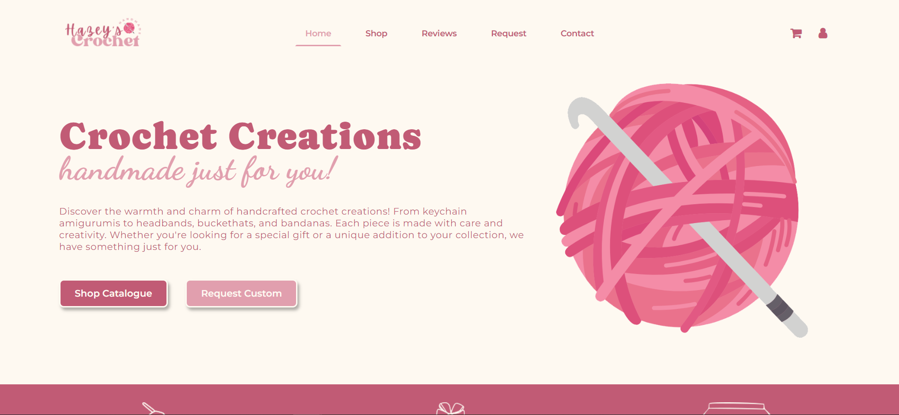
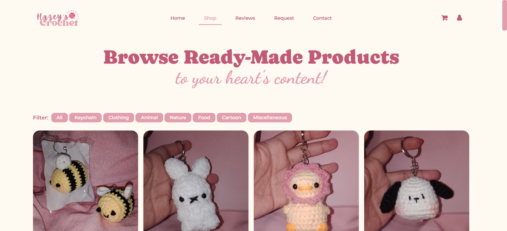
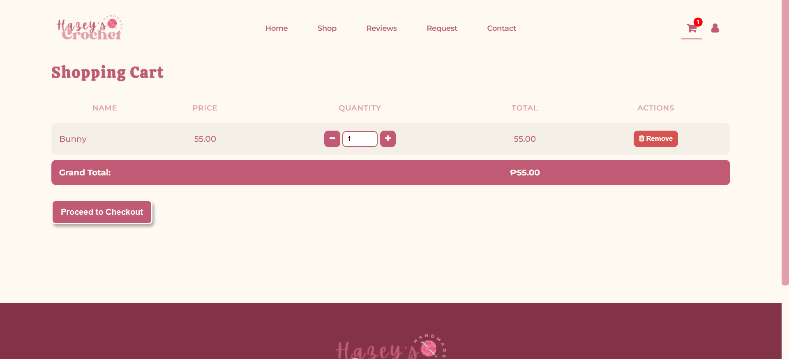
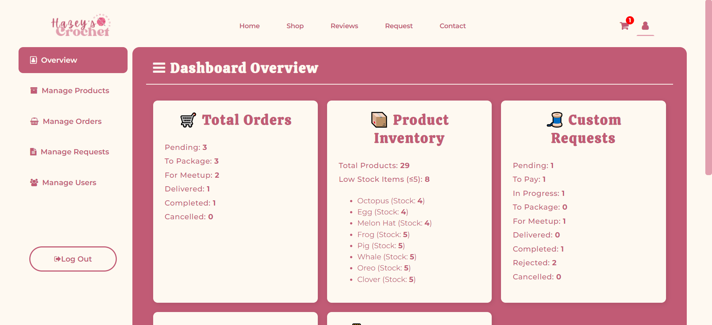
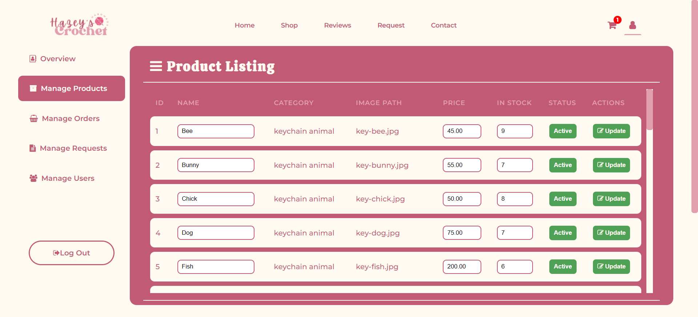
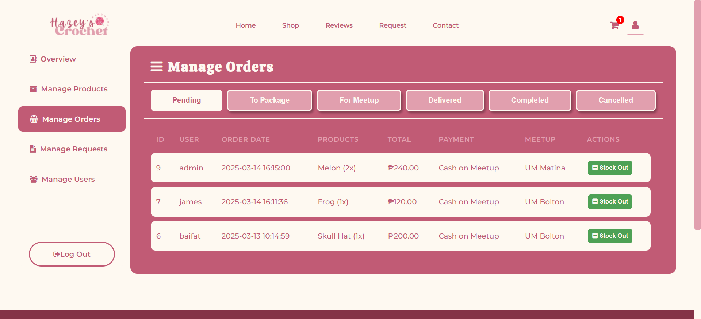

# Hazey's Crochet

### Online Business Management and E-Commerce Platform

Hazey's Crochet is a web-based business management and e-commerce platform developed to support the operations of a handmade crochet business. The system enables customers to browse products, place orders, submit custom requests, and provide reviews, while administrators can manage products, orders, customer requests, and business operations through a dedicated dashboard.

## Overview

Small businesses often face challenges in managing inventory, customer orders, and communication using manual processes. Hazey's Crochet was developed to provide a centralized platform that streamlines these operations while creating a convenient online shopping experience for customers.

The project combines e-commerce functionality with business management tools, helping improve efficiency, organization, and customer engagement.

## Features

### Customer Features

- User registration and login
- Product browsing and shopping
- Shopping cart management
- Order placement and tracking
- Payment submission
- Custom crochet request submission
- Product reviews and ratings
- Contact and inquiry system

### Administrator Features

- Product management
- Order management
- Customer management
- Request approval and processing
- Delivery and meetup tracking
- Payment verification
- Review monitoring
- Business reporting

## Technologies Used

- PHP
- MySQL
- HTML
- CSS
- JavaScript
- XAMPP
- Apache

## Project Motivation

The project was created to help a small crochet business establish an online presence while improving the management of products, customer requests, and transactions. By digitizing these processes, the platform aims to reduce manual workload and provide a more seamless experience for both customers and business owners.

## Database Setup

1. Install XAMPP.
2. Start Apache and MySQL.
3. Open phpMyAdmin.
4. Create a database.
5. Import:

database/hazeyscrochet_db.sql

6. Update database connection settings if necessary.

## Screenshots

### Homepage

### Product Catalog

### Shopping Cart

### Admin Dashboard

## Future Improvements

- Online payment gateway integration
- Inventory analytics dashboard
- Mobile-responsive redesign
- Order notification system
- Customer loyalty and rewards features

## Contributors

This project was developed as part of a three-person project.

### Team Members

- Christian James Cahilig
- Bai Fatima Andong
- Karylle Mish Gellica

## My Contributions

- Developed front-end and back-end functionalities
- Implemented product and order management features
- Designed database interactions and workflows
- Assisted with user interface development
- Participated in system testing and debugging
- Contributed to documentation and system design

## Learning Outcomes

This project strengthened my understanding of:

- Web Development
- Database Management
- E-Commerce Systems
- Business Process Automation
- User Experience Design
- Full-Stack Development
